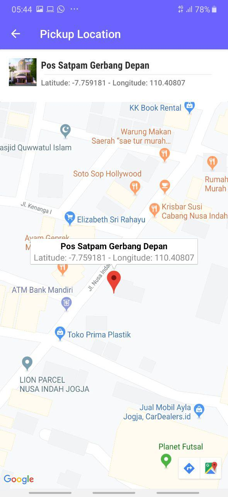
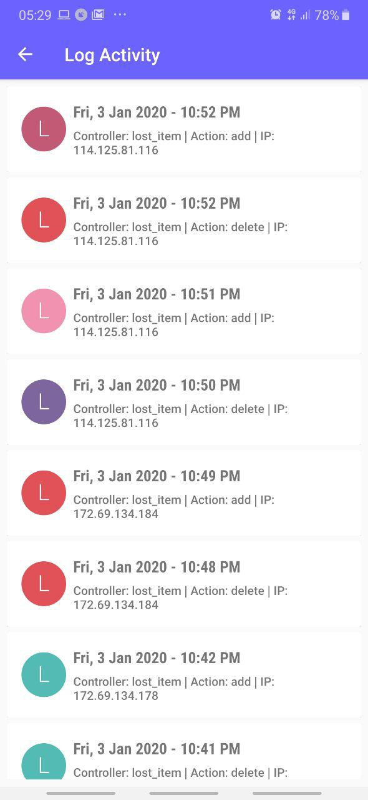
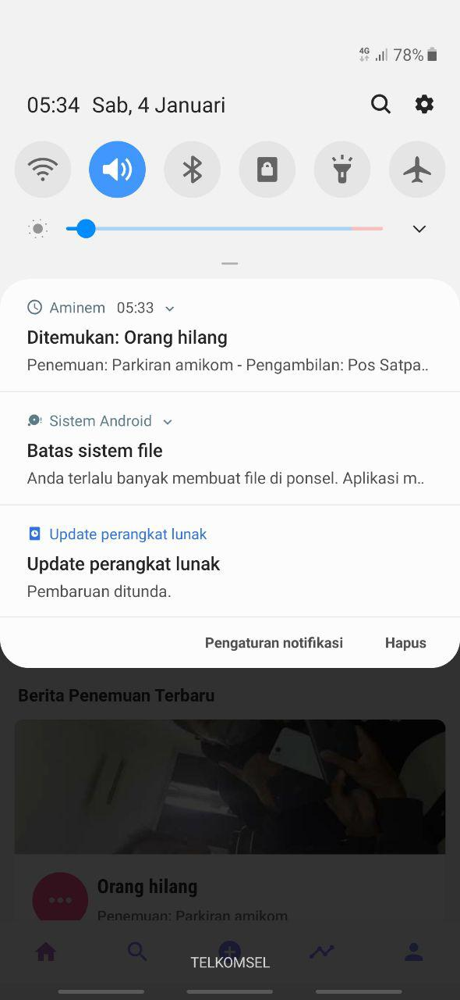

# Aminem Apps
Aminem atau Amikom Nemu adalah sebuah aplikasi android yang berfungsi untuk memberikan informasi terkait penemuan barang hilang yang ada disekitaran kampus Universitas AMIKOM Yogyakarta. Aplikasi ini memiliki fitur seperti upload, history, search, point dan reward.

## Arsitektur & Plugins
- REST API (http://indiarkmedia.com/api/v1)
- Google Maps Service
- Glide for Load Image from Internet
- Bitmap for Selected Image Upload
- Firebase Cloud Messanging for Notification
- PhotoView for Zoom In and Zoom Out Image
- Retrofit 2.0
- OkHttp

## Features
- Splash Screen
- Intro on first installation
- Login with NIM & Password that connected to mhs.amikom.ac.id using scraping
- Home
- Image Flipper
- Post by Category
- Recent Post Data
- Search
- Posting
- History
- Detail Lost Item
- Update Lost Item
- Delete Lost Item
- Profile
- Change Password
- Image Zooming
- Pickup Location using Google Maps
- Reward Poin
- Vouchers
- Log Activity
- Realtime Notification
- About 

## Screenshot

## Active Bugs
- Infinite RecyleView still not work (fix soon)
- Need to change UI/UX in change password (need some improvement)

**Masih banyak bug, ya maap - maap saja ya hehe :) Namnya juga lagi belajar satu semester doang**