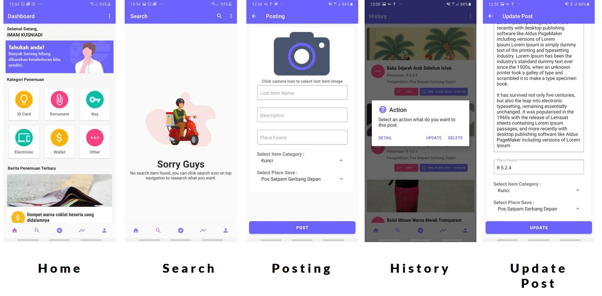

# Aminem - Amikom Nemu Mobile Application
Aminem atau Amikom Nemu adalah sebuah aplikasi android yang berfungsi untuk memberikan informasi terkait penemuan barang hilang yang ada disekitaran kampus Universitas AMIKOM Yogyakarta. Aplikasi ini memiliki fitur seperti upload, history, search, point dan reward.

Aplikasi ini dikususkan untuk mahasiswa Amikom untuk melakukan pelaporan penemuan barang dan juga dapat melakukan pencarian barang yang hilang dengan fitur search. Untuk menggunakan aplikasi ini hanya perlu login dengan menggunakan akun mhs.amikom.ac.id dalam artian hanya perlu memasukan NIM dan Passwordnya. 

Aplikasi mempunyai 6 kategori barang hilang yaitu Kartu Identitas, Dompet, Dokumen, Elektronik, Kunci dan Lainya. Dengan adanya category ini diharapkan dapat mepermudah pencarian barang hilang. Pengguna dapat meposting penemuan barangnya kemudian menyerahkan barang temuanya ke petugas satpam atau tempat penitipan barang hilang diamikom. Pada aplikasi akan terdapat informasi foto barang hilang beserta tempat pengambilan nantinya. Tempat pengambilan akan menggunakan fitur Google Maps apabila orang yang kehilangan barang kurang tau tempat pengambilanya. Setiap pelaporan yang telah diproses dalam hal ini barang yang ditemukan sudah dikembalikan ke pemiliknya, si pelapor akan mendapatkan poin. Poin yang didapatkan dapat ditukurkan menjadi voucer belanja di citramart atau kantin amikom. Untuk alasan keamanan pengguna dapat melihat aktifitas yang dialakukan di menu Log Activity, karena aplikasi yang kami buwat sangat menjunjung keamanan pengguna kami.

Aplikasi ini dibuat dilatar belakangi oleh sering terjadinya kehilangan barang pada mahasiswa Amikom. Sehingga diharapkan dengan aplikasi ini dapat memudahkan mahasiswa Amikom untuk melaporkan penemuan barang dan pencarian barang hilang.

## Arsitektur & Plugins
- REST API (http://indiarkmedia.com/api/v1)
- Google Maps Service
- Glide for Load Image from Internet
- Bitmap for Selected Image Upload
- Firebase Cloud Messanging for Notification
- PhotoView for Zoom In and Zoom Out Image
- Retrofit 2.0
- OkHttp

## Features
- Splash Screen
- Intro on first installation
- Login with NIM & Password that connected to mhs.amikom.ac.id using scraping
- Home
- Image Flipper
- Post by Category
- Recent Post Data
- Search
- Posting
- History
- Detail Lost Item
- Update Lost Item
- Delete Lost Item
- Profile
- Change Password
- Image Zooming
- Pickup Location using Google Maps
- Reward Poin
- Vouchers
- Log Activity
- Realtime Notification
- About 

## Screenshot

## Active Bugs
- Infinite RecyleView still not work (fix soon)
- Need to change UI/UX in change password (need some improvement)

**Masih banyak bug, ya maap - maap saja ya hehe :) Namnya juga lagi belajar satu semester doang**